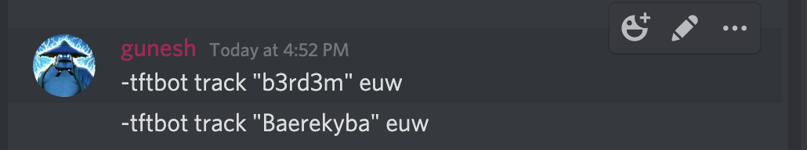
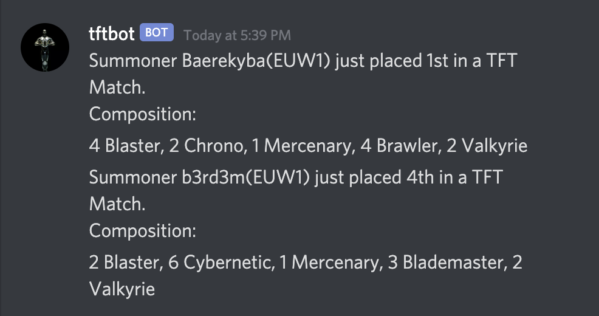

## Beta Release

Track using `-tftbot track "\<Summoner Name>" \<Region>`.



The bot will then send an update to the channel whenever the Summoner finishes a TFT Match.



## Running the Bot
1) Obtain bot token from Discord Developer Portal
2) Obtain Riot API Key from Riot Developer Portal
3) Create `.env` file in the main directory in the following format:
    ```
    RIOT_API_KEY=<YOUR RIOT API KEY>
    DISCORD_TOKEN=<YOUR DEVELOPER TOKEN>
    ```
4) Start bot with
    ```
    node src/bot.js
    ```

## Progress Tracking
- https://trello.com/b/TCR4mTRC/tftbot

## References
- https://www.digitaltrends.com/gaming/how-to-make-a-discord-bot/ (Bot Tutorial)
- https://medium.com/davao-js/2019-tutorial-creating-your-first-simple-discord-bot-47fc836a170b (Bot Tutorial)
- https://medium.com/davao-js/v2-tutorial-deploy-your-discord-bot-to-heroku-part-2-9a37572d5de4 (Hosting)
- https://discord.js.org/#/docs/main/stable/general/welcome (discord.js Documentation)
- https://www.npmjs.com/package/twisted (LOL API Wrapper for Node.js)
- https://developer.riotgames.com/apis#tft-match-v1 (Riot API Documentation)
